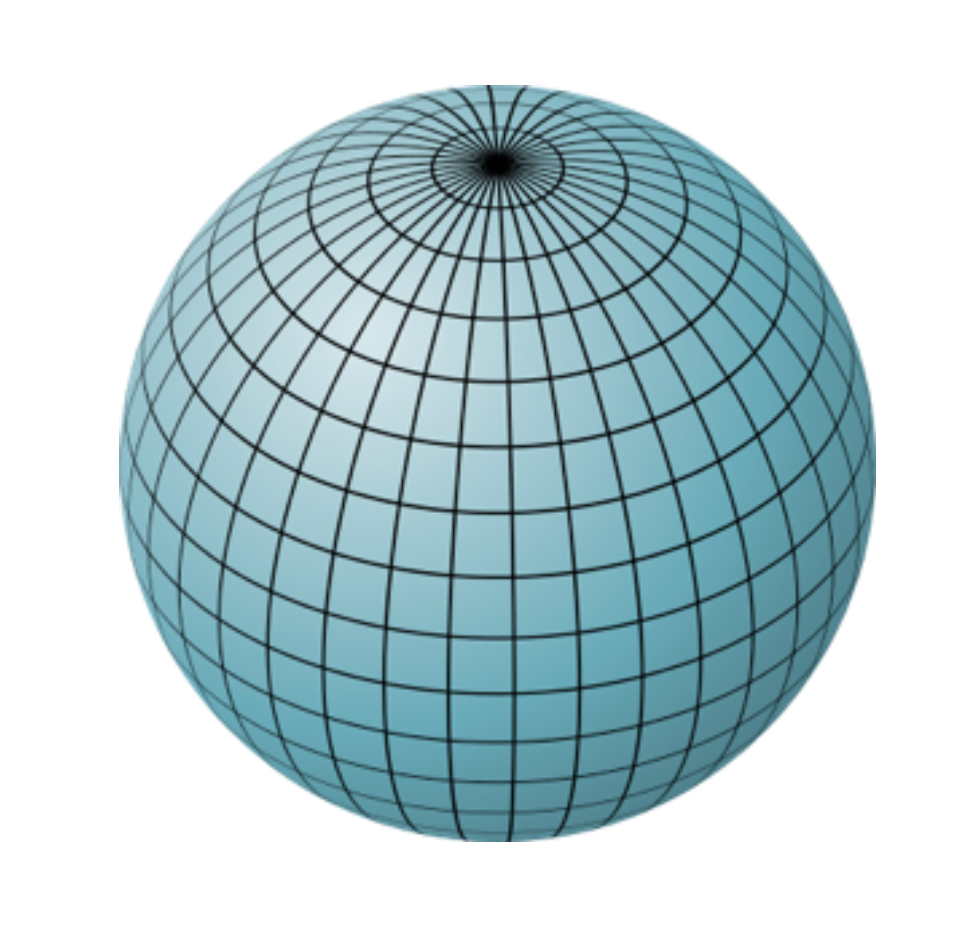
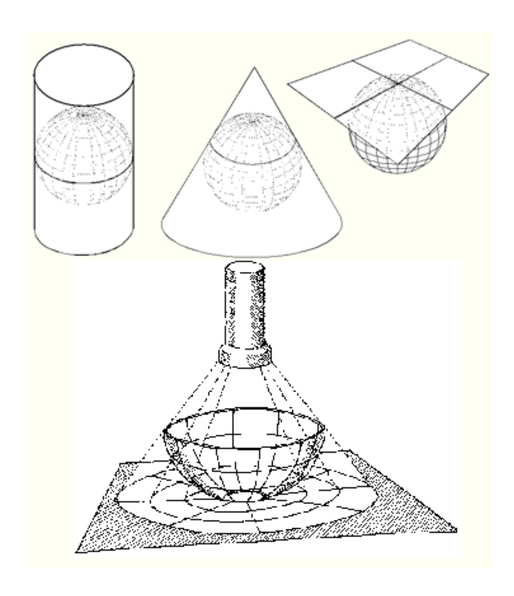
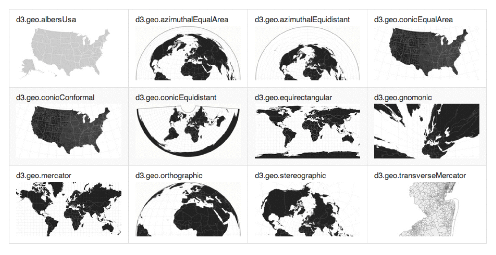

# Maps and Cartography

### Coordinates System

A coordinate system is a reference system used to represent the locations of geographic features. It provides a framework for defining real-world locations.

### GCS

Geographic Coordinate System refer to a three dimensional spherical surface to define locations on earth

### GPS (Global Positioning System)

1. Spherical coordinates measured from the earth's center in decimal degree, called geographic coordinates, expressed as latitude and longitude.
2. Planar coordinated, the earth's coordinated are projected onto a two dimensional planar surface (cartesian plane) (i.e. Mercator map projection model).

1. Longitude (vertical lines called meridians) (usually the x value)
2. Latitude (horizontal lines called parallels) are angles from the earth's center to a point on the earth's surface. (usually the y value)

1. The prime meridian which measure zero passes thought Greenwich, England. The range is from -180° to 180°
2. The midway latitude parallel between poles is the equator which measure zero degree. The range si from north pole 90° to south pole -90°

# Projections

A projection of spherical coordinates on a plane produce always distortions. Different projection strategies produce different distortions.
A projection rely also to Scale and Center.

source:
http://edndoc.esri.com/arcobjects/9.2/NET/89b720a5-7339-44b0-8b58-0f5bf2843393.htm

### Projections in d3.js

[https://github.com/d3/d3/wiki/Geo-Projections](https://github.com/d3/d3/wiki/Geo-Projections)

# Formats

### GeoJSON data format

Is an open format for encoding a variety of geographic data structures, based on JSON notation. It is widely supported and it is the format D3.js understands.

    http://www.geojson.org/geojson-spec.html

### TopoJSON data format

Is an extension to GeoJSON that encodes topology.
It represents geometries using shared segments called arcs.
It eliminates redundancy thus it is much more compact but it is difficult to read.

### Shapefiles

Is a digital vector storage format for storing geometric location and associated attribute information. It is very popular and widely used.

# Tools

Mapshaper, Online converter
[http://www.mapshaper.org/](http://www.mapshaper.org/)
    
GDAL, converter framework
[http://www.kyngchaos.com/software/frameworks](http://www.kyngchaos.com/software/frameworks)    
    
QGis, Open source editor
[http://www.qgis.org/](http://www.qgis.org/)

# Articles

[From Shapefile to GeoJSON](http://vallandingham.me/shapefile_to_geojson.html)

[Interactive Map with d3.js](http://www.tnoda.com/blog/2013-12-07)

